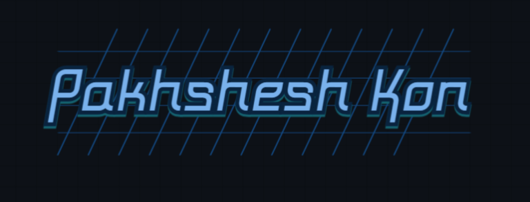

# پخشش کن! (Pakhshesh Kon)



**پخشش کن!** یک پنل مدیریت VPN پیشرفته و حرفه‌ای با معماری **MVC** است که با استفاده از **V2Ray** طراحی شده تا اتصال امن و سریع به سرورهای ایران و خارجی را فراهم کند. این پروژه با رابط کاربری مدرن، امنیت پیشرفته، و کدهای تمیز و قابل نگهداری، تجربه‌ای حرفه‌ای برای مدیریت سرورها و کاربران ارائه می‌دهد.

[](https://opensource.org/licenses/GNU)
[](https://github.com/mahdikbk/pakhshesh-kon/releases)
[](https://github.com/mahdikbk/pakhshesh-kon/issues)

---

## ✨ ویژگی‌های کلیدی

### 🚀 عملکرد و معماری
- ✅ **معماری MVC حرفه‌ای**: ساختار تمیز و قابل نگهداری با جداسازی کامل Concerns
- ✅ **PSR-4 Autoloading**: استفاده از استانداردهای PHP برای سازماندهی کد
- ✅ **Object-Oriented Programming**: کدهای تمیز و قابل استفاده مجدد
- ✅ **Composer Integration**: مدیریت وابستگی‌ها به صورت حرفه‌ای
- ✅ **Environment Configuration**: مدیریت تنظیمات با فایل `.env`

### 🔒 امنیت پیشرفته
- ✅ **CSRF Protection**: محافظت کامل در برابر حملات Cross-Site Request Forgery
- ✅ **Rate Limiting**: محدودیت تعداد درخواست‌ها برای جلوگیری از سوء استفاده
- ✅ **Input Validation & Sanitization**: اعتبارسنجی و پاکسازی کامل ورودی‌ها
- ✅ **Password Hashing (bcrypt)**: رمزنگاری امن رمزهای عبور
- ✅ **Session Management**: مدیریت امن Session ها
- ✅ **Security Headers**: تنظیمات امنیتی در Apache
- ✅ **SQL Injection Prevention**: استفاده از Prepared Statements

### 📊 مدیریت و مانیتورینگ
- ✅ **Real-time Monitoring**: نمایش زنده پینگ، ترافیک، و کاربران فعال
- ✅ **نمودارهای تعاملی**: نمودارهای ترافیک، پینگ، و کاربران با Chart.js
- ✅ **Load Balancing**: انتخاب خودکار بهترین سرور بر اساس Ping و Load
- ✅ **Advanced Logging**: ثبت کامل فعالیت‌های سیستم در دیتابیس
- ✅ **Automated Backups**: بکاپ خودکار دیتابیس و فایل‌ها

### 🎨 رابط کاربری
- ✅ **Tailwind CSS**: طراحی مدرن و Responsive
- ✅ **Yekan Font**: فونت زیبای فارسی یکان
- ✅ **Advanced Animations**: انیمیشن‌های نرم و جذاب
- ✅ **Dark/Light Theme**: پشتیبانی از تم روشن و تاریک
- ✅ **RTL Support**: پشتیبانی کامل از راست به چپ

### 🔧 قابلیت‌های فنی
- ✅ **V2Ray Integration**: پشتیبانی از VLESS+TLS و VMess+WS
- ✅ **RESTful API**: رابط API برای ادغام با اپلیکیشن‌های موبایل
- ✅ **Telegram Notifications**: ارسال اعلان‌های مهم به تلگرام
- ✅ **QR Code Generation**: تولید خودکار QR کد برای کاربران
- ✅ **Multi-Server Management**: مدیریت چندین سرور خارجی
- ✅ **IPv6 Support**: پشتیبانی کامل از IPv6

### 📦 نصب و راه‌اندازی
- ✅ **نصب کاملاً خودکار**: فقط یک دستور برای نصب کامل
- ✅ **تشخیص خودکار نوع سرور**: تشخیص خودکار سرور ایران یا خارجی
- ✅ **تشخیص خودکار دامنه**: استفاده از Reverse DNS یا IP
- ✅ **SSL خودکار**: تنظیم خودکار گواهی SSL با Certbot
- ✅ **Firewall Configuration**: تنظیم خودکار Firewall

---

## 📋 پیش‌نیازها

قبل از نصب، مطمئن شوید سرور شما این شرایط را دارد:

- **سیستم‌عامل**: Ubuntu 20.04+ یا Debian 11+
- **حداقل سخت‌افزار**:
  - CPU: 1 هسته
  - RAM: 512MB (1GB توصیه می‌شود)
  - فضای دیسک: 10GB
- **دسترسی‌ها**: دسترسی root یا sudo
- **اتصال اینترنت**: برای دانلود وابستگی‌ها و گواهی SSL
- **دامنه (برای سرور ایران)**: دامنه‌ای که به IP سرور resolve شود (Cloudflare Proxy باید خاموش باشد)

---

## 🚀 نصب سریع

### نصب کاملاً خودکار

برای نصب **پخشش کن!**، فقط این یک دستور را اجرا کنید:

```bash
sudo bash install.sh
```

یا از GitHub:

```bash
bash <(curl -Ls https://raw.githubusercontent.com/mahdikbk/pakhshesh-kon/main/install.sh --ipv4)
```

### ✨ چه اتفاقی می‌افتد؟

اسکریپت به صورت **کاملاً خودکار**:

1. ✅ **تشخیص نوع سرور**: به صورت خودکار سرور ایران یا خارجی را تشخیص می‌دهد
2. ✅ **تشخیص دامنه**: از Reverse DNS، Hostname، یا IP استفاده می‌کند
3. ✅ **نصب پکیج‌ها**: تمام پکیج‌های لازم (Apache, PHP, MariaDB, V2Ray, ...) را نصب می‌کند
4. ✅ **تنظیم دیتابیس**: دیتابیس را ایجاد و پیکربندی می‌کند
5. ✅ **نصب V2Ray**: V2Ray را نصب و پیکربندی می‌کند
6. ✅ **تنظیم SSL**: گواهی SSL را با Certbot تنظیم می‌کند
7. ✅ **کپی فایل‌ها**: فایل‌های پروژه را کپی می‌کند
8. ✅ **نصب Dependencies**: Composer dependencies را نصب می‌کند
9. ✅ **ایجاد .env**: فایل تنظیمات را ایجاد می‌کند
10. ✅ **ایجاد دیتابیس**: جداول دیتابیس را با Indexes ایجاد می‌کند
11. ✅ **تنظیم Apache**: Apache را پیکربندی می‌کند
12. ✅ **تنظیم Firewall**: Firewall را پیکربندی می‌کند
13. ✅ **ایجاد Admin**: کاربر Admin را ایجاد می‌کند

**هیچ ورودی از کاربر نیاز نیست!** 🎉

### 📝 اطلاعات دسترسی

پس از نصب، تمام اطلاعات مهم در این فایل ذخیره می‌شود:

```
/var/log/pakhsheshkon_install_summary.txt
```

این فایل شامل:
- 🔗 URL پنل
- 👤 نام کاربری و رمز عبور Admin
- 🗄️ اطلاعات دیتابیس
- 🔌 پورت V2Ray
- 🔑 کد یکتای سرور (برای سرورهای خارجی)

⚠️ **مهم**: این فایل را در جای امن ذخیره کنید!

### 📊 خروجی نمونه

```bash
════════════════════════════════════════
   نصب با موفقیت انجام شد!
════════════════════════════════════════

📋 اطلاعات دسترسی:
   URL: https://iran.example.com
   نام کاربری: admin
   رمز عبور: [رمز تصادفی تولید شده]

📊 اطلاعات فنی:
   V2Ray Port: 443
   Database: pk_xxxxxxxx

⚠️  تمام اطلاعات در فایل زیر ذخیره شده:
   /var/log/pakhsheshkon_install_summary.txt

✅ سیستم آماده استفاده است!
```

---

## 📖 راهنمای استفاده

### 🔐 ورود به پنل

1. به آدرس پنل (از فایل خلاصه نصب) بروید
2. با نام کاربری و رمز Admin وارد شوید
3. داشبورد با نمودارهای Real-time را مشاهده کنید

### 👥 مدیریت کاربران

- **ایجاد کاربر**:
  - به بخش **کاربران** بروید
  - اطلاعات (نام کاربری، ترافیک، تعداد اتصال، روز، گروه سرور) را وارد کنید
  - لینک V2Ray و QR کد به صورت خودکار تولید می‌شود
- **دانلود گروهی**: لینک‌های همه کاربران را به صورت ZIP دانلود کنید

### 🖥️ مدیریت سرورها

- **اضافه کردن سرور خارجی**:
  - کد یکتای سرور خارجی (تولید شده توسط اسکریپت) را وارد کنید
  - گروه سرور (مثل اروپا) را انتخاب کنید
- **مانیتورینگ**: وضعیت سرورها (پینگ، ترافیک، کاربران فعال) را در بخش **مانیتورینگ** مشاهده کنید

### 🔄 به‌روزرسانی

- به بخش **به‌روزرسانی** بروید
- روی دکمه **به‌روزرسانی از گیت‌هاب** کلیک کنید
- پنل به صورت خودکار از مخزن گیت‌هاب به‌روزرسانی می‌شود

---

## 🏗️ ساختار پروژه (MVC)

پروژه با معماری **MVC** و استانداردهای **PSR-4** سازماندهی شده است:

```
pakhshesh-kon/
├── public/                          # فایل‌های عمومی (Entry Point)
│   ├── index.php                    # Entry Point اصلی
│   ├── assets/                      # CSS, JS, Fonts
│   │   ├── css/
│   │   ├── js/
│   │   └── fonts/
│   └── qrcodes/                     # QR Code های کاربران
│
├── src/                             # کدهای اصلی
│   ├── Core/                        # هسته سیستم
│   │   ├── Config.php               # مدیریت تنظیمات (.env)
│   │   ├── Database.php             # لایه انتزاعی دیتابیس (PDO)
│   │   ├── Security.php             # امنیت (CSRF, Rate Limit, Validation)
│   │   ├── Session.php              # مدیریت Session
│   │   └── Logger.php                # سیستم لاگ
│   │
│   ├── Models/                      # مدل‌های دیتابیس
│   │   ├── User.php                 # مدل کاربر
│   │   ├── Admin.php                # مدل ادمین
│   │   ├── Server.php               # مدل سرور
│   │   ├── ServerGroup.php          # مدل گروه سرور
│   │   ├── Monitoring.php           # مدل مانیتورینگ
│   │   └── Ticket.php                # مدل تیکت
│   │
│   ├── Controllers/                 # کنترلرها
│   │   ├── AuthController.php       # احراز هویت
│   │   ├── DashboardController.php # داشبورد
│   │   ├── UserController.php       # مدیریت کاربران
│   │   ├── ServerController.php     # مدیریت سرورها
│   │   ├── MonitoringController.php # مانیتورینگ
│   │   └── ApiController.php        # API RESTful
│   │
│   ├── Services/                    # سرویس‌ها
│   │   ├── V2RayService.php         # مدیریت V2Ray
│   │   ├── QRCodeService.php         # تولید QR کد
│   │   ├── TelegramService.php       # اعلان تلگرام
│   │   ├── BackupService.php         # بکاپ خودکار
│   │   └── LoadBalancerService.php   # توزیع بار
│   │
│   └── Helpers/                      # توابع کمکی
│       ├── Validator.php             # اعتبارسنجی
│       ├── Formatter.php             # فرمت‌دهی
│       └── Utils.php                 # توابع عمومی
│
├── views/                            # View ها (Frontend)
│   ├── layouts/                      # Layout ها
│   ├── auth/                         # صفحات احراز هویت
│   ├── dashboard/                    # داشبورد
│   ├── users/                        # مدیریت کاربران
│   ├── servers/                      # مدیریت سرورها
│   └── monitoring/                  # مانیتورینگ
│
├── database/                         # دیتابیس
│   └── migrations/                   # Migration Scripts
│       ├── 001_add_indexes.sql
│       └── 002_improve_tables.sql
│
├── tests/                            # تست‌ها
│   ├── Unit/                         # Unit Tests
│   │   ├── SecurityTest.php
│   │   └── ValidatorTest.php
│   └── Integration/                  # Integration Tests
│
├── storage/                          # ذخیره‌سازی
│   ├── logs/                         # لاگ‌ها
│   ├── backups/                      # بکاپ‌ها
│   └── cache/                        # کش
│
├── vendor/                           # Composer Dependencies
├── composer.json                     # Composer Configuration
├── .env.example                      # نمونه تنظیمات
├── phpunit.xml                       # PHPUnit Configuration
├── install.sh                        # اسکریپت نصب خودکار
└── README.md                         # این فایل
```

---

## 🔧 تنظیمات و پیکربندی

### فایل `.env`

پس از نصب، فایل `.env` در مسیر نصب ایجاد می‌شود. می‌توانید تنظیمات را تغییر دهید:

```env
# Database
DB_HOST=localhost
DB_NAME=pakhsheshkon_db
DB_USER=pakhsheshkon_user
DB_PASS=your_secure_password

# Application
APP_ENV=production
APP_DEBUG=false
APP_URL=https://your-domain.com
BASE_URL=

# Security
CSRF_SECRET=your_csrf_secret_key
SESSION_LIFETIME=3600
RATE_LIMIT_ENABLED=true
RATE_LIMIT_MAX_ATTEMPTS=5
RATE_LIMIT_WINDOW=300
API_KEY=your_api_key

# Telegram (Optional)
TELEGRAM_ENABLED=false
TELEGRAM_BOT_TOKEN=
TELEGRAM_CHAT_ID=

# V2Ray
V2RAY_IRAN_PORT=443
V2RAY_CONFIG_PATH=/usr/local/etc/v2ray/config.json

# Backup
BACKUP_ENABLED=true
BACKUP_PATH=/var/backups/pakhsheshkon
BACKUP_RETENTION_DAYS=30
```

---

## 🧪 تست‌ها

پروژه شامل تست‌های Unit و Integration است:

```bash
# نصب PHPUnit
composer install --dev

# اجرای تست‌ها
composer test
# یا
vendor/bin/phpunit
```

---

## 📝 لاگ‌ها و عیب‌یابی

### مسیرهای لاگ

- **لاگ‌های نصب**: `/var/log/pakhsheshkon.log`
- **خلاصه نصب**: `/var/log/pakhsheshkon_install_summary.txt`
- **لاگ‌های Apache**: `/var/log/apache2/pakhsheshkon-error.log`
- **لاگ‌های V2Ray**: `/var/log/v2ray/error.log`
- **لاگ‌های برنامه**: `storage/logs/app.log`

### رفع خطاهای رایج

#### خطای 500
```bash
# بررسی لاگ‌های Apache
tail -f /var/log/apache2/pakhsheshkon-error.log

# بررسی ماژول PHP
php -m | grep pdo_mysql

# بررسی دسترسی‌ها
ls -l /var/www/html/
```

#### مشکل دیتابیس
```bash
# تست اتصال دیتابیس
mysql -u [DB_USER] -p [DB_NAME] -e "SELECT 1"

# اطلاعات از فایل خلاصه نصب
cat /var/log/pakhsheshkon_install_summary.txt
```

#### مشکل V2Ray
```bash
# بررسی وضعیت سرویس
systemctl status v2ray

# تست تنظیمات
v2ray test -config /usr/local/etc/v2ray/config.json

# بررسی لاگ‌ها
tail -f /var/log/v2ray/error.log
```

---

## 🔐 امنیت

### ویژگی‌های امنیتی پیاده‌سازی شده

- ✅ **CSRF Protection**: محافظت در برابر حملات CSRF
- ✅ **Rate Limiting**: محدودیت تعداد درخواست‌ها
- ✅ **Input Validation**: اعتبارسنجی کامل ورودی‌ها
- ✅ **SQL Injection Prevention**: استفاده از Prepared Statements
- ✅ **XSS Protection**: پاکسازی خروجی‌ها
- ✅ **Password Hashing**: استفاده از bcrypt
- ✅ **Session Security**: مدیریت امن Session ها
- ✅ **Security Headers**: تنظیمات امنیتی در Apache

### توصیه‌های امنیتی

1. 🔒 فایل `.env` را در جای امن نگه دارید
2. 🔒 رمزهای عبور قوی استفاده کنید
3. 🔒 Firewall را فعال نگه دارید
4. 🔒 به‌روزرسانی‌های امنیتی را نصب کنید
5. 🔒 از SSL/TLS استفاده کنید

---

## 🚀 ویژگی‌های پیشرفته

### Load Balancing

سیستم به صورت خودکار بهترین سرور را بر اساس:
- ⚡ Ping (زمان پاسخ)
- 📊 Load (تعداد کاربران فعال)
- 🎯 Score (ترکیب Ping و Load)

انتخاب می‌کند.

### Automated Backups

بکاپ خودکار دیتابیس:
- 📅 هر شب ساعت 2 صبح
- 💾 ذخیره در `/var/backups/pakhsheshkon/`
- 🗑️ حذف خودکار بکاپ‌های قدیمی (30 روز)

### Telegram Notifications

ارسال اعلان‌های مهم:
- ⚠️ اتمام ترافیک کاربر
- 🔴 سرور آفلاین
- ✅ سرور آنلاین شد
- 📊 گزارش روزانه

---

## 📚 مستندات بیشتر

- 📖 [راهنمای نصب خودکار](INSTALL_GUIDE.md)
- 📖 [راهنمای ارتقا](README_UPGRADE.md)
- 📖 [ساختار پروژه](PROJECT_STRUCTURE.md)
- 📖 [خلاصه تغییرات](UPGRADE_SUMMARY.md)
- 📖 [شروع سریع](QUICK_START.md)
- 📖 [تحلیل پروژه](ANALYSIS.md)

---

## 🤝 مشارکت

ما از مشارکت شما استقبال می‌کنیم! برای مشارکت:

1. 🍴 Fork کنید
2. 🌿 یک Branch جدید ایجاد کنید (`git checkout -b feature/AmazingFeature`)
3. 💾 تغییرات را Commit کنید (`git commit -m 'Add some AmazingFeature'`)
4. 📤 Push کنید (`git push origin feature/AmazingFeature`)
5. 🔄 Pull Request ایجاد کنید

### گزارش باگ

برای گزارش باگ یا پیشنهاد قابلیت جدید:
- 📝 یک [Issue](https://github.com/mahdikbk/pakhshesh-kon/issues) در GitHub باز کنید

---

## 📄 لایسنس

این پروژه تحت [لایسنس GNU GPL v3](LICENSE) منتشر شده است.

---

## 🙏 تشکر

ساخته شده با ❤️ توسط **MahdiKBK**

از همه کاربران و مشارکت‌کنندگان که **پخشش کن!** را به یک پروژه حرفه‌ای تبدیل کردند، تشکر می‌کنیم!

---

## 📞 پشتیبانی

- 🐛 [گزارش باگ](https://github.com/mahdikbk/pakhshesh-kon/issues)
- 💬 [سوالات](https://github.com/mahdikbk/pakhshesh-kon/discussions)
- 📧 ایمیل: [mahdi@example.com](mailto:mahdi@example.com)

---

<div align="center">

**⭐ اگر این پروژه برای شما مفید بود، لطفاً Star بدهید! ⭐**

</div>
